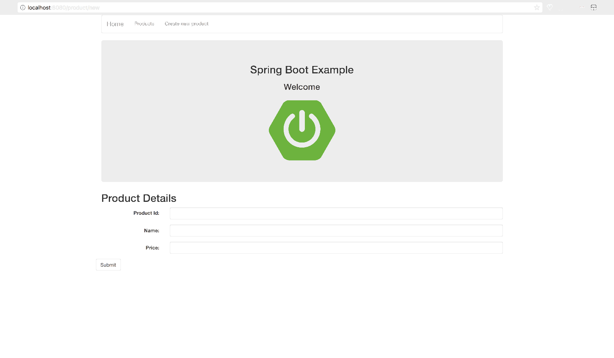

# springboot-crud-demo

A demonstração do Spring Boot CRUD está demonstrando como implementar operações CRUD simples com uma entidade `Product`.

## O que tem dentro 
Este projeto é baseado no [Spring Boot](http://projects.spring.io/spring-boot/) projeto e usa esses pacotes :
- Maven
- Spring Core
- Spring Data (Hibernate & MySQL)
- Spring MVC (Tomcat)
- [Thymleaf](https://thymeleaf.org)



## Instalação
O projeto é criado com Maven, então você só precisa importá-lo para o seu IDE e construir o projeto para resolver as dependências

## Configuração de banco de dados
Crie um banco de dados MySQL com o nome `springbootdb` e adicione as credenciais a`/resources/application.properties`.
Os padrões são:

```
spring.datasource.url=jdbc:mysql://localhost:3306/springbootdb
spring.datasource.username=root
spring.datasource.password=
spring.jpa.hibernate.ddl-auto=update
```

## Uso 
Execute o projeto por meio da IDE e vá para [http://localhost:8080](http://localhost:8080)

ou

execute este comando na linha de comando:
```
mvn spring-boot:run
```
